<!-- ===== Animated banner (committed SVG — always renders) ===== -->

  

<!-- ===== Animated typing tagline (committed SVG) ===== -->

  

<!-- ===== Social badges (shields.io — reliable) ===== -->

  
  
  
  

---

### 👨‍💻 About me

I build scalable SaaS and cloud-native platforms **end to end** — from a drag-and-drop React UI to a
Go/Node API to the Terraform that ships it. Currently a Full Stack Developer at **Stefanini**;
previously **UDT/Havrion**, **Omnix IA**, and **Xpectrum**, where I shipped three Samsung Smart TV
apps, ML services on genetic algorithms, and 20+ production AWS Lambdas.

- 🔭 Building a real **Digital Signage Platform** for restaurants in Barranquilla (see below)
- 🌱 Deep in **AI agents** — LangChain / LangGraph / RAG
- ⚡ Rare stuff I actually ship: **Samsung Tizen/SSSP**, real-time **WebSockets**, **Neo4j**, multi-cloud **IaC**
- 📫 Reach me: **jdavid.ilias@gmail.com**

---

### 🚀 Featured project — Digital Signage Platform

> A restaurant owner edits a menu in a web editor and it renders **live on Samsung Smart TVs** as a
> digital menu board. One product, three surfaces + infra — the rare skills, shown working end to end.

  
  
  
  
  
  

| Repo | Surface | Stack |
|---|---|---|
| 🎨 [signage-web](https://github.com/jonathanDavid/signage-web) | Drag-and-drop menu editor | React 18 · Vite · dnd-kit |
| ⚙️ [signage-api](https://github.com/jonathanDavid/signage-api) | REST + WebSocket API | NestJS · Prisma · PostgreSQL |
| 📺 [signage-tv](https://github.com/jonathanDavid/signage-tv) | Samsung Tizen / SSSP player | Vanilla TS · esbuild (ES2017) |
| ☁️ [signage-infra](https://github.com/jonathanDavid/signage-infra) | Infrastructure | Terraform · ECS · RDS · K8s |

---

### 🧰 Tech stack

**Languages**

  
  
  
  

**Frontend &nbsp;·&nbsp; Backend**

  
  
  
  
  
  

**Cloud &nbsp;·&nbsp; DevOps &nbsp;·&nbsp; Data**

  
  
  
  
  
  
  
  

---

### 📊 GitHub stats

  
  

  

<i>🛠️ Landing soon: a Go/WebSocket live dashboard, a Neo4j route-graph app, and an AI road-trip planner agent.</i>

<!-- ===== Animated wave footer (committed SVG) ===== -->

  

